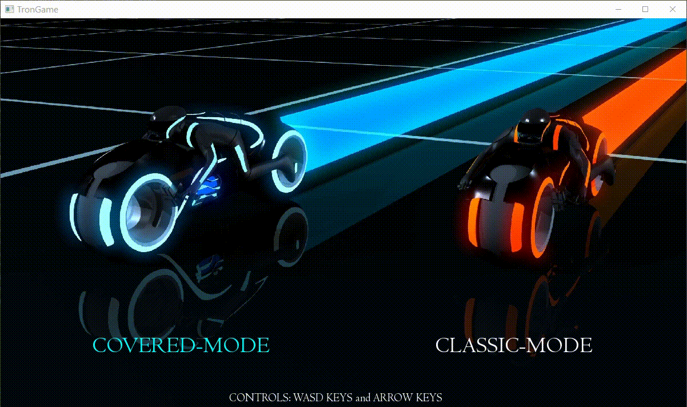
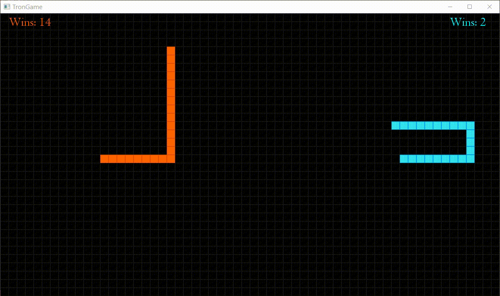
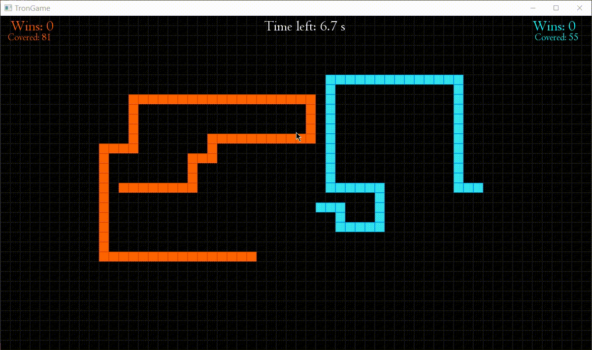

# TronGame
Tron game implemented in C++ with graphics using SFML library.

Game menu:

Gameplay between two players can take place in two modes:

Classic mode:
- Collisions with opponent or your trace.
- No countdown.

Covered mode: 
- Collisions with opponent or your trace.
- Game last specified ammount of time.
- When time is up winner is determined by higher coverage of the map.
- If the same coverage, no one gets the score.

Menu background from :
https://www.deviantart.com/pforbes88/art/Tron-Legacy-Light-Cycles-270490896
